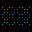
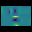
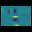
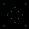
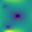
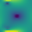

# Recurrent Inpainting Model (RIM)

This repository contains the implementation of the **RIM** (*Recurrent Inpainting Model*) applied to the reconstruction of strain maps or physical fields from incomplete data obtained via distributed sensors. The architecture is based on a conditional reverse process, with a denoising model trained on RGB-encoded spatial maps.

This code is designed as reproducible support for the experiments presented in the article:  
> **Full strain matrix estimation in thin-walled structures with recurrent inpainting model**  
> *Cruz-Alonso, Terroba, Cuesta-Infante*  
> [Journal name, year]

---

## Project structure

```
rim/
├── main_rim.py                # Main training script
├── inference_rim.py           # Main inference script
├── config/
│   └── models.ini             # Model and training configuration
├── models/
│   ├── rim.py                 # RIM model implementation
│   └── unet.py                # UNet model used as denoising network
├── utils/
│   ├── metrics.py             # Loss functions and metrics
│   ├── generate_mask.py       # Mask and data generation
│   ├── others.py              
│   └── mask_cube.npy          # (Optional) Predefined undefined mask
├── docs/                       
└── dataset/                   # Dataset folder
    ├── cube/                  
    └── surface/
```

---

## Requirements

- Python ≥ 3.10  
- TensorFlow ≥ 2.10  
- NumPy, Pillow, matplotlib, OpenCV, wandb (optional)

Recommended installation (virtual environment):

```bash
python -m venv venv
source venv/bin/activate
pip install -r requirements.txt
```

> Make sure to register custom loss functions in `utils/metrics.py`, such as `loss_inpainting`, `gradient_diff_loss`, etc.

---

## Training

Place your input data in the `train/` and `test/` folders. Ensure they are `.png` or `.jpg` images with square dimensions.

Then run:

```bash
python main_rim.py
```

The model will train using the configuration defined in `config/models.ini` and checkpoints will be saved in the `checkpoints/` folder.

---

## Input and output

This model supports two types of input data: **Cube** and **Surface** datasets. Both represent RGB-encoded spatial maps with sparse sensor readings, but differ in their masking strategy.

---

### Cube mode

| Input                | Target                | Output                |
|----------------------|-----------------------|------------------------|
|  |  |  |

### Surface mode

| Input                  | Target                  | Output                  |
|------------------------|-------------------------|--------------------------|
|  |  |  |


---

> All inputs and outputs are expected in RGB format. Internally, the model operates via a recurrent denoising process guided by reverse steps.

---

## Configuration (`config/models.ini`)

Below is an example of the configuration block used by RIM:

```
[RIM]
timesteps = 5
threshold_relative = 0.6
beta_min = 0.05
beta_max = 0.2
intensity_realce = 0.03
intensity_smooth = 0.2
umbral_realce = 20
color_peak = 1.0, 1.0, 0.0
color_trough = 0.3, 0.0, 0.5
```

### Parameter descriptions

The table below explains each parameter and its role in the refinement and denoising process:

- **`timesteps`**: Number of reverse steps. Defines how many iterations are used to denoise the image step-by-step.
- **`threshold_relative`**: Proportion (e.g., `0.6`) of the total steps where enhancement is applied. With `5` timesteps, this means enhancement occurs from step `2` to `0`.
- **`beta_min`, `beta_max`**: Define the linear noise schedule range. Control how strongly noise is removed at each step.
- **`intensity_realce`**: Intensity of the enhancement applied to peaks and troughs during the final steps.
- **`intensity_smooth`**: Intensity of the spatial smoothing applied using a Gaussian kernel in every step.
- **`umbral_realce`**: Percentage threshold to define **peaks** (top percentile) and **troughs** (bottom percentile) based on luminance.
- **`color_peak`**: RGB color to apply to highlight **peaks** (brightest regions).
- **`color_trough`**: RGB color to apply to highlight **troughs** (darkest regions).

These parameters directly affect the image quality and post-processing behavior of the model during inference. Tuning them can help emphasize structural features or suppress noise more aggressively.

---

## Citation

If you use this code or results derived from this model, please cite the associated paper:

```bibtex
@article{XXX,
  title={Full strain matrix estimation in thin-walled structures with recurrent inpainting model},
  author={Cruz-Alonso, Terroba, Cuesta-Infante},
  journal={XXX},
  year={2025}
}
```

---

For any technical questions, contact the lead author or open an issue in the repository.
